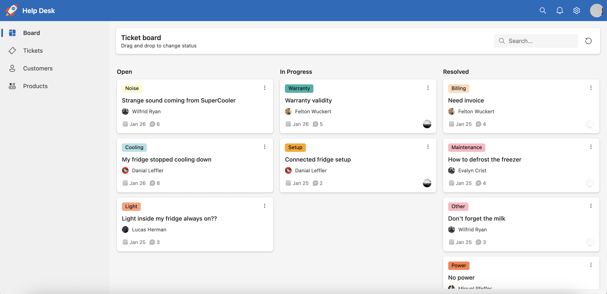
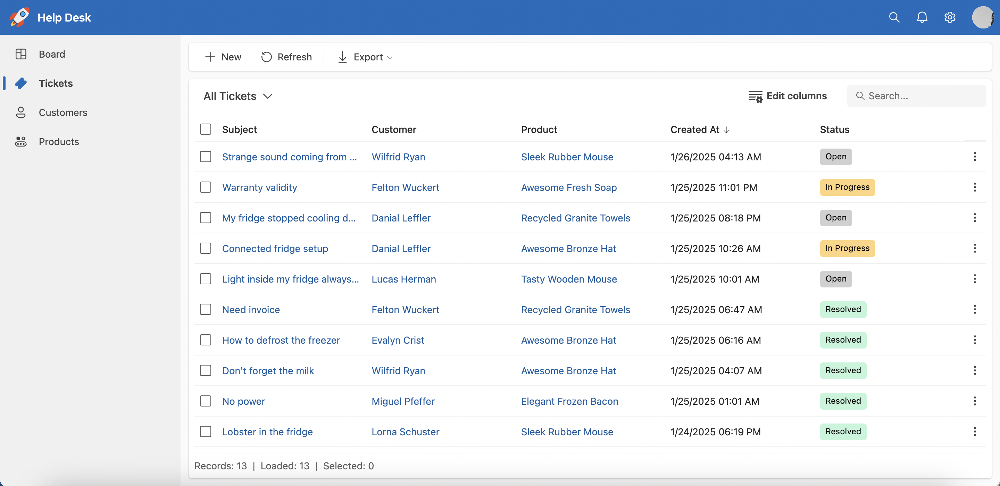
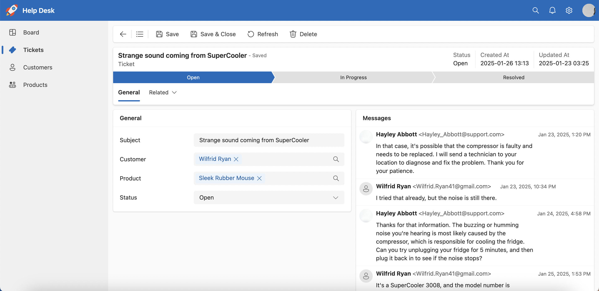

# Headless AdminApp 

Headless AdminApp is a web-based application designed to manage administrative tasks efficiently. This project is built using modern web technologies to provide a seamless user experience. By leveraging a headless architecture, it allows for greater flexibility and scalability in integrating with various frontend frameworks and third-party services.

[Documentation](https://headless-adminapp.github.io/) | [Demo](https://headless-adminapp-examples.vercel.app) | [Examples](https://github.com/kishanmundha/headless-adminapp-examples)

## Features

- 🔒 **Security** - Comprehensive user authentication and authorization with customizable options. All data can be filtered based on authentication configuration to ensure secure access.
- 📈 **Analytics** - Integrated support for dashboards and boards to provide quick and insightful data analysis, helping users make informed decisions.
- 🗂️ **Data Management** - Efficient handling of Create, Read, Update, and Delete (CRUD) operations to manage your data seamlessly.
- 🎨 **Customizable UI** - Customize individual UI components or replace the entire template with your own custom design.

## Get Started

- Clone [boilerplate repository](https://github.com/headless-adminapp/boilerplate) to get start with the project and follow the instructions in the README file.

## Contributing

Contributions are welcome! Please fork the repository and create a pull request with your changes.

## License

This project is licensed under the MIT License. See the [LICENSE](LICENSE) file for details.

## Contact

For any inquiries, please create an issue in the project repository on GitHub.
